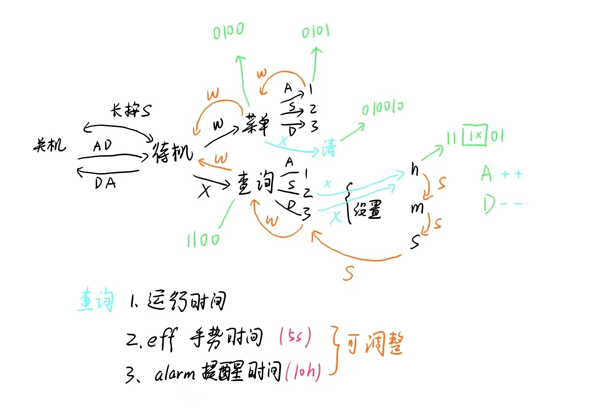

# DigitalLogicProject
CS207_2024_Fallterm@SUSTECH_Project

剩余任务：
1.bonus
2.完善代码风格以及注释部分
3.尽量减少bug

日程安排
12.10
blue：add clean mode
wzx：综合状态转换
wly：开关机测试

ddl：12.12开会前 争取当天能够跑目前所有完整代码，基本完成basic部分

# 抽油烟机功能测试项目

## 参数设置

1. **出厂设置**：
   - 所有涉及的时间（清洁智能提醒相关的抽油烟工作累计时长10小时，自清洁的3分钟工作时间、飓风模式下的60秒倒计时、开关机手势模拟的5秒有效时间）均为出厂设置，可调整缩短。
   - 可通过高级设置功能对个别参数进行设置。
   - 可通过“恢复出厂设置”按键让这些参数恢复到出厂设置的值。（未实现）

## 开关机功能

2. **开机与关机**：
   a) 开机：短按开关机键实现开机操作，开机后抽油烟机完成初始化。
   - 抽油烟机初始化的表现：当前时间为0小时0分0秒，累计使用时间为0。[✓]
     b) 关机：长按3秒开关机键实现关机操作，关机后所有开关按键都失效。[ ] （未实现）
     c) 用按键操作模拟手势开关实现开关机功能：
      i. 先按左键开启5秒倒计时，在5秒内再按右键为开机操作。[✓]
      ii. 先按右键开启5秒倒计时，在5秒内再按左键为关机操作。[✓]
      iii. 在5秒倒计时内没完成操作的后半部分则相当于操作失效。[✓]

## 模式切换

3. **模式切换**：
   a) 抽油烟机开机后进入待机模式，待机模式下先按菜单键准备切换模式，然后通过不同按键进入不同模式。[✓]
   b) 从不同的工作模式返回待机模式：
         1) 抽油烟的1档和2档工作模式都可以通过按菜单键后直接返回待机模式。[✓]
         2) 抽油烟的3档工作模块是在按菜单键后开始60秒倒计时，倒计时到期再返回待机模式。[✓] **(先出现 00：00：00，后出现 00：00：60，需要优化)**
         3) 抽油烟的自清洁模式在开始工作后开启3分钟倒计时，倒计时到期后再返回待机模式。[✓] **(和上面一样的问题，测试时有时从175s开始倒计时？)**

## 抽油烟功能

4. **抽油烟功能**：
   a) 待机模式下，按动菜单键进入模式切换，再按动档位按键进入抽油烟模式下的不同风力档位。[✓]
   b) 进入任何挡位的抽油烟工作模式时即开启累积计时，结束抽油烟模式时停止计时，存储开机后抽油烟的累积工作时长。[✓]
   c) 风力一级档位：按动1档键，抽油烟机进入一级档位工作，按动菜单键切换回待机模式。[✓]
   d) 风力二级档位：按动2档键，抽油烟机进入二级档位工作，按动菜单键切换回待机模式。[✓]
   e) 风力一级档位与风力二级档位抽油烟模式下，可以通过按动档位按键相互进行切换。[✓]
   f) 风力三级档位（飓风工作模式）：
      i. 飓风模式在每次开机后只能使用一次。[✓]
      ii. 按动3档按键，抽油烟机进入三级档位（飓风模式）工作，同时开启飓风工作模式的60秒倒计时，倒计时结束后，自动进入二级档位继续工作。[ ]
      iii. 飓风工作模式的60秒倒计时未结束时，如按动菜单键进行强制待机，则启动返回待机模式的60秒倒计时，倒计时结束后，自动进入待机模式。[ ] （未实现这个状态，这个状态仍然是 飓风模式，累计工作时间）

## 自清洁功能

5. **自清洁功能**：
   a) 自清洁模式：
      i. 仅能通过待机模式进入自清洁模式。[✓]
      ii. 待机模式下，按动菜单键，再按动自清洁按键进入自清洁模式，同时开启3分钟倒计时，倒计时结束后，提醒自清洁完成，自动进入待机模式。[✓]

## 辅助功能

6. **辅助功能**：
   a) 照明功能：开机后任何模式下都可以开启或者关闭照明功能。[✓]
   b) 时间功能：
      i. 时间显示：开机后动态显示当前时间（小时、分钟、秒）。[✓]
      ii. 时间设置：待机模式下，通过输入设置时、分调整时间。[ ]
   c) 智能提醒：抽油烟工作模式下会统计抽油烟工作的累计时长，当该工作时长达到指定数值，在待机模式下抽油烟机将通过输出设备提醒用户进行手动清洗或者开启自清洁。[ ]
   d) 高级设置：在待机模式下可以对部分参数进行重新设置。[ ] **（暂时可以加，不能减，不能进位）**
   e) 查询功能：
      - 在待机模式下可以实现查询：抽油烟模式下的累计工作时间；手势开关的有效时间。[✓]

## 附加分

7. **附加分**：
   1. 用按键操作模拟手势开关实现开关机功能：[✓]
   2. 使用拨码开关、按键开关以外的输入设备（方便用户操作）：[ ] **（键盘）**
   3. 使用7段数码管、LED以外的输出设备（方便用户查看结果）：[ ] **（音频输出）**
